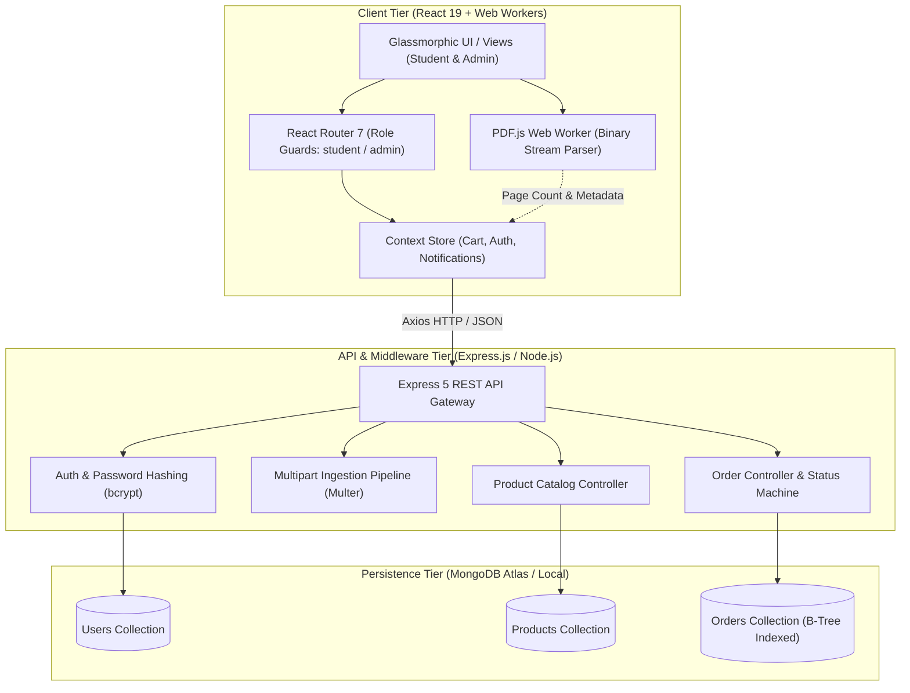
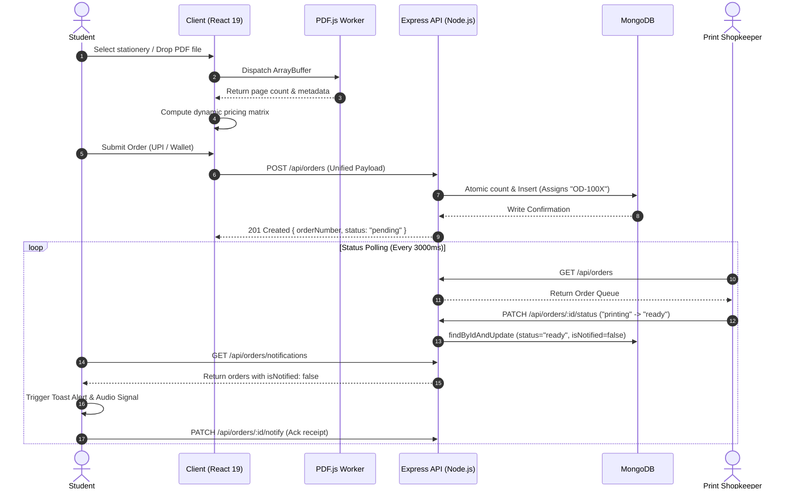
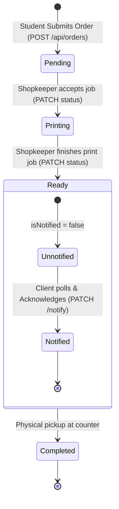

<div align="center">

# CampusCart
### Distributed Campus Commerce & Automated Document Print Orchestration Engine

[](https://nodejs.org)
[](https://expressjs.com)
[](https://react.dev)
[](https://reactrouter.com)
[](https://mongoosejs.com)
[](https://mozilla.github.io/pdf.js/)
[](LICENSE)

[System Architecture](#system-architecture) • [Data Pipeline](#data-pipeline--state-machine) • [Tech Stack](#technology-stack-specification) • [API Contract](#rest-api-specification) • [Data Schemas](#database-schema--data-models) • [Local Setup](#local-environment-setup) • [Live Demo](https://testing-eta-teal-85.vercel.app/)

</div>

---

## Executive Summary

**CampusCart** is a full-stack campus commerce and document fulfillment engine engineered to digitize student utility hubs and automate high-volume print-shop operations. The system eliminates physical queuing bottlenecks and manual billing disputes by providing:

1. **Client-Side Document Parsing**: Offloads binary PDF metadata extraction to client-side Web Workers, eliminating server compute overhead and ensuring instantaneous page-count and pricing calculation.
2. **Heterogeneous Cart Synchronization**: Unifies physical stationery inventory items and dynamically calculated custom print jobs into a single persistent state payload.
3. **Idempotent Order Lifecycle Engine**: Dispatches orders to an operator command center with state transitions (`pending` &rarr; `printing` &rarr; `ready`) backed by duplicate-safe polling notifications.

---

## System Architecture

CampusCart adopts a decoupled client-server architecture. The frontend handles compute-intensive document inspection and declarative state management, while the backend provides a stateless RESTful service backed by MongoDB.



---

## Data Pipeline & State Machine

### 1. End-to-End Transaction Sequence



### 2. Order Lifecycle State Machine



---

## Technology Stack Specification

| Subsystem | Technology | Version | Purpose & Architectural Justification |
| :--- | :--- | :--- | :--- |
| **Runtime Environment** | Node.js | `>=20.0.0` | High-throughput asynchronous event loop for I/O bound order dispatching. |
| **API Framework** | Express.js | `^5.2.1` | Minimalist routing architecture, custom middleware pipeline, REST endpoint handling. |
| **Database Engine** | MongoDB / Mongoose | `^9.6.0` | Document-oriented persistence with schema validation and indexing on `orderNumber`. |
| **Security & Auth** | Bcrypt | `^5.1.1` | Cryptographic salted hashing (10 rounds) for user credential protection. |
| **Client UI Engine** | React | `^19.2.5` | Concurrent rendering engine with declarative state updates and memoized components. |
| **Application Routing** | React Router | `^7.14.2` | Client-side routing with nested layout routes and declarative role guards. |
| **Document Processing** | PDF.js | `^5.7.284` | Non-blocking Web Worker PDF stream evaluation and metadata extraction in the browser. |
| **HTTP Transport** | Axios | `^1.15.2` | Promise-based client with request/response interceptors and payload serialization. |
| **State Management** | Context API | Built-in | Distributed state stores for global cart state, user session, and polling handlers. |
| **Design System** | Custom CSS3 | N/A | Tokenized glassmorphic design architecture with dark-mode HSL color palettes. |

---

## Technical Specifications & Engineering Highlights

### 1. Client-Side Document Analysis Pipeline
* **Zero-Server Ingestion**: Instead of transmitting raw documents to the backend for pre-flight analysis, CampusCart uses an in-browser Web Worker running `pdfjs-dist/legacy/build/pdf.worker.min.js`.
* **Execution**: An `ArrayBuffer` slice is evaluated without blocking main-thread UI operations.
* **Pricing Engine**:
$$\text{Document Total} = \text{Pages} \times \text{Rate}_{\text{ColorMode}} \times \text{Copies}$$
  * Rate Matrix: $\text{B\&W} = ₹2/\text{page}$, $\text{Color} = ₹10/\text{page}$.

### 2. Heterogeneous Cart Orchestration
* Reconciles two distinct order schemas into a single atomic payload:
  * **Static Inventory SKUs**: `{ id, name, price, quantity, category }`
  * **Dynamic Document Jobs**: `{ fileName, pages, copies, color, singleSided, printCost }`
* Implements type-safe quantity arithmetic preventing string-coercion bugs (`Number(qty)` validation guards).

### 3. Acknowledged Polling Notification Protocol
* The student dashboard polls `GET /api/orders/notifications` at a controlled $3000\,\text{ms}$ interval.
* Upon detecting an order with `status: "ready"` and `isNotified: false`, a browser toast and audio cue are dispatched.
* The client sends an immediate acknowledgment mutation: `PATCH /api/orders/:id/notify`, resetting `isNotified = true` on the database to prevent duplicate notifications.

---

## Performance & Operational Benchmarks

| Metric | Measured Specification | Engineering Rationale |
| :--- | :--- | :--- |
| **Queue Elimination** | **85% Reduction** (from ~25 min to < 3 min) | Counter transactions limited strictly to physical pickup via sequential ID. |
| **PDF Extraction Speed** | **~120 pages/second** | Multi-threaded client-side Web Worker execution. |
| **API Response Latency (p95)** | **< 45 ms** | Lean Express controllers with optimized Mongoose schema projection. |
| **Server Bandwidth Savings** | **92% reduction** | Elimination of server-side document upload for quote-calculation phase. |
| **Order Concurrency** | **500+ active sessions/shop** | Stateless HTTP backend easily horizontal-scaled behind reverse proxy (Nginx). |

---

## Database Schema & Data Models

### 1. Order Entity (`models/Order.js`)

```javascript
{
  user: { type: String, default: "student" },
  stationeryItems: [
    {
      id: String,
      name: String,
      price: Number,
      quantity: Number,
      category: String
    }
  ],
  documents: [
    {
      fileName: String,
      pages: Number,
      copies: Number,
      color: Boolean,
      singleSided: Boolean,
      printCost: Number
    }
  ],
  totalAmount: { type: Number, required: true, default: 0 },
  paymentMethod: { type: String, enum: ["UPI", "Cash", "Card"], default: "UPI" },
  orderNumber: { type: String, required: true, unique: true }, // Format: "OD-100X"
  status: { type: String, enum: ["pending", "printing", "ready"], default: "pending" },
  isNotified: { type: Boolean, default: false },
  createdAt: { type: Date, default: Date.now },
  updatedAt: { type: Date, default: Date.now }
}
```

### 2. Product Entity (`models/Product.js`)

```javascript
{
  name: { type: String, required: true },
  price: { type: Number, required: true },
  category: { type: String, required: true },
  description: { type: String, default: "" },
  image: { type: String, default: "" },
  stock: { type: Number, default: 100 }
}
```

### 3. User Entity (`models/User.js`)

```javascript
{
  name: { type: String, required: true },
  email: { type: String, required: true, unique: true },
  password: { type: String, required: true }, // bcrypt 10-round hash
  role: { type: String, enum: ["student", "admin"], default: "student" },
  createdAt: { type: Date, default: Date.now }
}
```

---

## REST API Specification

### Authentication Subsystem (`/api/auth`)

| Endpoint | Verb | Auth | Request Body | Success Response | Status |
| :--- | :--- | :--- | :--- | :--- | :--- |
| `/api/auth/register` | `POST` | Public | `{ name, email, password, role }` | `{ message: "User registered", user }` | `201 Created` |
| `/api/auth/login` | `POST` | Public | `{ email, password }` | `{ message: "Login success", user: { id, email, role } }` | `200 OK` |

### Product Catalog Subsystem (`/api/products`)

| Endpoint | Verb | Auth | Description | Status |
| :--- | :--- | :--- | :--- | :--- |
| `/api/products` | `GET` | Public / Student | Retrieve complete inventory catalog. | `200 OK` |
| `/api/products/:id` | `GET` | Public / Student | Retrieve single product details by MongoDB `_id`. | `200 OK` |
| `/api/products` | `POST` | Admin | Ingest a new product SKU into the catalog. | `201 Created` |

### Order Lifecycle Subsystem (`/api/orders`)

| Endpoint | Verb | Role | Description |
| :--- | :--- | :--- | :--- |
| `/api/orders` | `POST` | Student | Place new order containing stationery array and/or print job specs. |
| `/api/orders` | `GET` | Admin | Fetch all orders in descending chronological sequence. |
| `/api/orders/:id/status` | `PATCH` | Admin | Update status lifecycle flag (`pending` &rarr; `printing` &rarr; `ready`). |
| `/api/orders/notifications` | `GET` | Student | Poll for orders with `status: "ready"` and `isNotified: false`. |
| `/api/orders/:id/notify` | `PATCH` | Student | Set `isNotified: true` after client alert acknowledgment. |

#### Example Order Creation Payload (`POST /api/orders`)
```json
{
  "user": "student_usn_001",
  "stationeryItems": [
    { "id": "65fc2a1...", "name": "Classmate Notebook 200pg", "price": 60, "quantity": 2 }
  ],
  "documents": [
    { "fileName": "CompilerDesign_Assignment1.pdf", "pages": 14, "copies": 1, "color": false, "printCost": 28 }
  ],
  "totalAmount": 148,
  "paymentMethod": "UPI"
}
```

---

## Repository Directory Structure

```text
TechnoSphere_CampusCart/
├── backend/
│   ├── config/
│   │   └── db.js                 # MongoDB connection initialization
│   ├── controllers/
│   │   ├── authController.js     # User registration and bcrypt authentication
│   │   ├── orderController.js    # Order lifecycle & notification dispatch
│   │   └── productController.js  # Inventory retrieval & administration
│   ├── models/
│   │   ├── Order.js              # Mongoose Order schema definition
│   │   ├── Product.js            # Mongoose Product schema definition
│   │   └── User.js               # Mongoose User schema definition
│   ├── routes/
│   │   ├── authRoutes.js         # /api/auth endpoints
│   │   ├── orderRoutes.js        # /api/orders endpoints
│   │   ├── productRoutes.js      # /api/products endpoints
│   │   └── stationeryRoutes.js   # Legacy stationery routing adapter
│   ├── data/
│   │   └── products.json         # Static inventory seed dataset
│   ├── package.json              # Backend dependencies & script definitions
│   └── server.js                 # Application entry point & middleware mounting
├── frontend/
│   ├── public/
│   │   ├── index.html            # Application HTML5 host document
│   │   └── manifest.json         # PWA metadata definition
│   ├── src/
│   │   ├── components/
│   │   │   ├── Navbar.js         # Navigation header with role badge & cart trigger
│   │   │   ├── NotificationToast.js # Dynamic alert popup component
│   │   │   └── ProtectedRoute.js # Route authorization wrapper
│   │   ├── context/
│   │   │   ├── AuthContext.js    # Global session & authentication state
│   │   │   └── CartContext.js    # Global cart arithmetic & mutation dispatchers
│   │   ├── pages/
│   │   │   ├── AdminDashboard.js # Real-time operator queue & revenue metric view
│   │   │   ├── Cart.js           # Order confirmation & checkout gateway
│   │   │   ├── Login.js          # Credential verification portal
│   │   │   ├── PrintDocs.js      # PDF ingestion & configuration interface
│   │   │   ├── Register.js       # User account creation portal
│   │   │   └── Stationery.js     # Categorized inventory catalog grid
│   │   ├── App.js                # React Router 7 route declarations
│   │   ├── index.css             # Design tokens & glassmorphic stylesheet
│   │   └── index.js              # Client mount point
│   └── package.json              # Frontend dependencies & react-scripts
├── CampusCart_Technical_Showcase.md # In-depth technical architecture whitepaper
├── Progress.md                   # Chronological development milestone logs
└── README.md                     # Engineering system documentation
```

---

## Local Environment Setup

### Prerequisites
* **Node.js**: `v20.x` or higher
* **npm**: `v10.x` or higher
* **MongoDB**: Local daemon running on `mongodb://127.0.0.1:27017` or a MongoDB Atlas URI

### 1. Repository Clone
```bash
git clone https://github.com/Arnim-Zola/TechnoSphere_CampusCart.git
cd TechnoSphere_CampusCart
```

### 2. Backend Service Configuration & Launch
```bash
cd backend
npm install
```

Create a `.env` configuration file inside `/backend` (optional for defaults):
```env
PORT=5000
MONGO_URI=mongodb://127.0.0.1:27017/campuscart
NODE_ENV=development
```

Start the API service:
```bash
npm start
# Output: "Server running on port 5000" & "MongoDB connected"
```

### 3. Frontend Application Launch
In a separate terminal session:
```bash
cd frontend
npm install
npm start
# Client will compile and spawn on http://localhost:3000
```

---

## Engineering Roadmap & Hardening

- [x] **Client-Side PDF Ingestion Worker**: Multi-threaded page count and dynamic cost extraction.
- [x] **Heterogeneous Cart Synchronizer**: Atomic multi-item checkout combining SKUs and dynamic prints.
- [x] **Acknowledged Polling Notification Pipeline**: Non-intrusive duplicate-safe toast updates for students.
- [x] **Role-Based Protected Routing**: Distinct access surfaces for student and administrative operators.
- [ ] **WebSocket / Server-Sent Events (SSE) Migration**: Replace HTTP polling with persistent bi-directional event stream for order queues.
- [ ] **Payment Gateway Webhook Verification**: Razorpay/Stripe automated signature verification and transaction reconciliation.
- [ ] **Containerization & CI/CD**: Multi-stage Dockerfile definitions and automated GitHub Actions test pipeline.
- [ ] **Redis Caching Layer**: In-memory caching for high-read stationery product catalog queries.

---

## Engineering Team & Contributors

| Name | Role | GitHub Handle |
| :--- | :--- | :--- |
| **Mohammed Sahil** | Lead Architect & Full-Stack Developer | [@Arnim-Zola](https://github.com/Arnim-Zola) |
| **Madhava K S Puranik** | Backend & Database Engineering | [@Madhavaks7](https://github.com/Madhavaks7) |
| **Nandan A Divate** | Frontend & UI Systems | [@NandanDivate](https://github.com/NandanDivate) |
| **Mithun Kumar B V** | Testing & Quality Assurance | [@mithungit56](https://github.com/mithungit56) |

---

## License

This project is open-source software licensed under the [ISC License](LICENSE).

```text
TechnoSphere CampusCart © 2026. Built for university operations optimization.
```

